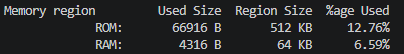

## VSCODE开发RTthread stm32模板
#
### 1、生成vscode
bsp目录下执行命令行执行
```bash
scons --dist --target=vsc
```
然后直接拷贝

### 2、要修改的地方
#### 1、board\CubeMX_Config路径下stmcubemx生成的Inc和Scr在Corn文件夹中，但是官方给的例程过早，没有Corn这个文件夹
修改在board\CubeMX_Config路径下的SConscript文件中的内容，将：

```c
# add general drivers
src = Split('''
board.c
CubeMX_Config/Src/stm32f1xx_hal_msp.c
''')

path =  [cwd]
path += [cwd + '/CubeMX_Config/Inc']
```

替换为：

```c
# add general drivers
src = Split('''
board.c
CubeMX_Config/Core/Src/stm32f1xx_hal_msp.c
''')

path =  [cwd]
path += [cwd + '/CubeMX_Config/Core/Inc']
```
#### 2、修改编译器路径
按自己电脑实际路径修改rtconfig.py中有关编译器的配置路径
```c
# EXEC_PATH is the compiler execute path, for example, CodeSourcery, Keil MDK, IAR
if  CROSS_TOOL == 'gcc':
    PLATFORM    = 'gcc'
    EXEC_PATH   = r'D:\tool_chains\STM32CubeCLT_1.21.0\GNU-tools-for-STM32\bin'
elif CROSS_TOOL == 'keil':
    PLATFORM    = 'armcc'
    EXEC_PATH   = r'C:/Keil_v5'
elif CROSS_TOOL == 'iar':
    PLATFORM    = 'iccarm'
    EXEC_PATH   = r'C:/Program Files (x86)/IAR Systems/Embedded Workbench 8.3'
```
#### 3、修改编译生成文件的路径
在SConstruct文件中
```python
TARGET = 'rt-thread.' + rtconfig.TARGET_EXT
```
添加
```python
# 将编译文件输出到 out 目录下
out_dir = 'out'
if not os.path.exists(out_dir):
    os.makedirs(out_dir)
TARGET = os.path.join(out_dir, 'rt-thread.' + rtconfig.TARGET_EXT)
```
在rtconfig.py文件中将
```python
POST_ACTION = OBJCPY + ' -O binary $TARGET rtthread.bin\n' + SIZE + ' $TARGET \n'
```
替换为
```python
POST_ACTION = OBJCPY + ' -O binary $TARGET out/rtthread.bin\n' + SIZE + ' $TARGET \n'
```
将
```python
LFLAGS = DEVICE + ' -Wl,--gc-sections,-Map=rt-thread.map,-cref,-u,Reset_Handler -T board/linker_scripts/link.lds'
```
替换为
```python
LFLAGS = DEVICE + ' -Wl,--gc-sections,-Map=out/rt-thread.map,-cref,-u,Reset_Handler -T board/linker_scripts/link.lds'
```
### 3、添加文件
添加launch.json,settings.json,tasks.json文件到.vscode文件下
添加openocd.cfg文件到根目录下

### 4、显示flash和ram占用


将rtconfig.py中的
```bash
LFLAGS = DEVICE + ' -Wl,--gc-sections,-Map=out/rt-thread.map,-cref,-u,Reset_Handler -T board/linker_scripts/link.lds'
```
替换为
```bash
LFLAGS = DEVICE + ' -Wl,--gc-sections,--print-memory-usage,-Map=out/rt-thread.map,-cref,-u,Reset_Handler -T board/linker_scripts/link.lds'
```
